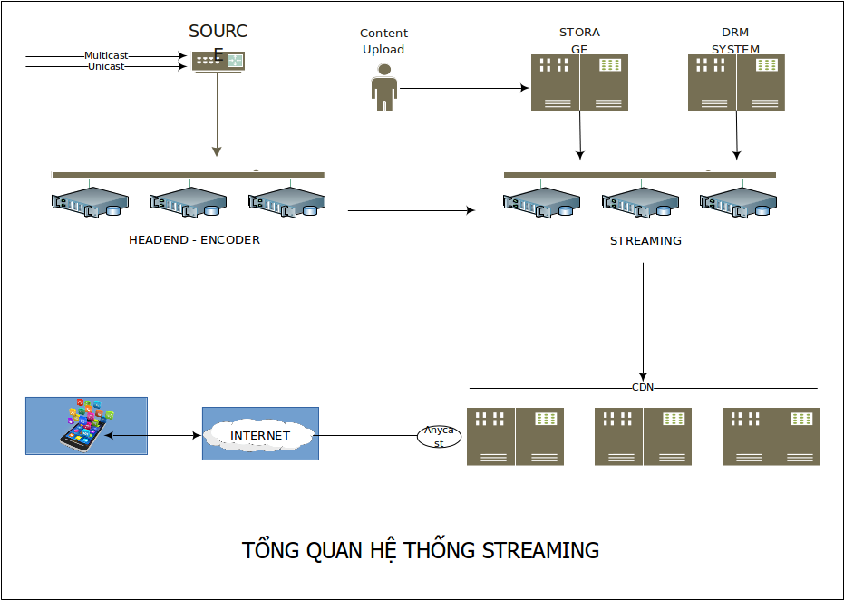

# Streaming Media

Một số nội dung streaming media, gồm:

- [Tìm hiểu về streaming](docs/About-Streaming.md)

- [Encode, decode, transcode,.. with FFmpeg](docs/About-FFmpeg.md)

- [Streaming media server với Nginx và nginx-rtmp module ](docs/Streaming-server-with-nginx-rtmp.md)

- [Dựng streaming media server với Docker](https://github.com/keepwalking86/streaming/tree/master/docker)

 

Updating...
