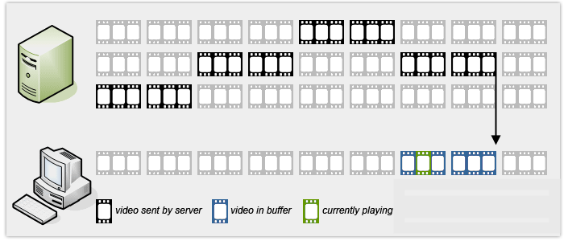
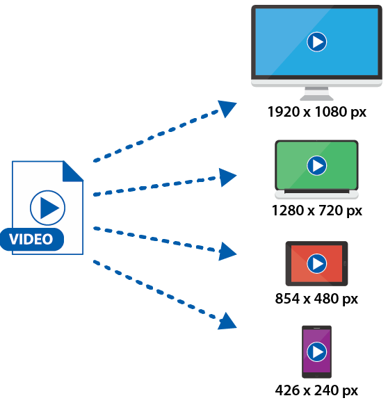
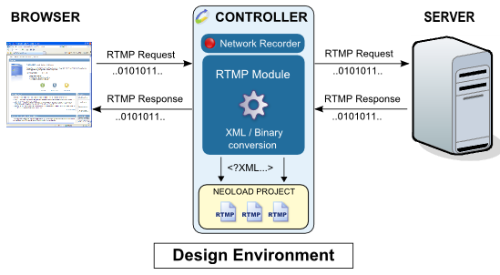
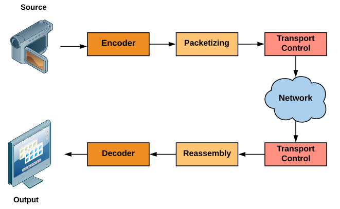

# About Streaming media

# Table of contents

- [1. Streaming là gì?](#about)
- [2. Một số giao thức streaming phổ biến](#streaming-protocols)
  - [2.1 Real-Time Messaging Protocol (RTMP)](#rtmp)
  - [2.2 Apple HTTP Live Streaming (HLS)](#hls)
  - [2.3 Realtime Transport Protocol (RTP) ](#rtp)
- [3. Một số thông tin khác](#bonus-concepts)

=============================================================================

# Content

## <a name="about">1. Streaming là gì?</a>

Streaming media (hay gọi tắt là streaming) là kỹ thuật mà thực hiện liên tục quá trình nhận và hiển thị multimedia (video, audio, ..) đến người dùng trong khi quá trình phân phối multimedia vẫn đang diễn ra.

Streaming video là một kiểu của streaming media mà dữ liệu từ tệp video tiếp tục được truyền qua internet đến người dùng. Nó cho một video được xem trực tuyến mà không cần phải download về máy tính hay một thiết bị.

Với các định dạng tập tin media truyền thống, dữ liệu chỉ có thể hiển thị khi đã được tải về toàn bộ, vì vậy đối với các tập tin media chất lượng cao có dung lượng lớn thì công việc này sẽ mất nhiều thời gian. Streaming media tiết kiệm thời gian cho người dùng bằng cách sử dụng các công nghệ giải nén kết hợp với hiển thị dữ liệu đồng thời trong lúc vẫn tiếp tục tải media về. Quá trình này được gọi là kỹ thuật đệm (buffering). Thay vì được gửi một lần duy nhất, dữ liệu streaming media sẽ được chia thành từng gói nhỏ, sau đó liên tục truyền những phần được chia ra. Ban đầu bên nhận sẽ lấy về một phần chia nhỏ của dữ liệu media và hiển thị những phần media đã nhận được, đồng thời trong lúc hiển thị các gói dữ liệu còn lại sẽ lần lượt được lấy về để kịp cho việc hiển thị tiếp theo. Minh họa ở hình dưới.

<p align="center"> 

</p>

Streaming video được thể hiện dưới hai loại:

- Video on demand – VoD (Video theo yêu cầu): là các dữ liệu Video được lưu trữ trên máy chủ đa phương tiện và được truyền đến người dùng khi có yêu cầu, người dùng có toàn quyền để hiển thị cũng như thực hiện các thao tác (tua, dừng, quay lại...) với các đoạn dữ liệu này.

- Live Streaming (Video thời gian thực): là các dữ liệu Video được chuyển phát trực tiếp từ các nguồn cung cấp dữ liệu theo thời gian thực (máy camera, microphone,thiết bị phát dữ liệu Video...).

Lấy ví dụ về dễ hình dung nhất cho 02 loại này như sau:

- VoD: Xem phim, nhạc online trên zing, youtube, hdviet

- Live streaming: youtube live, facebook live, bigo,...

Streaming media sử dụng các giao thức RTMP,HTTP, .. để truyền dữ liệu qua mạng, đồng thời sử dụng các chuẩn nén để giảm dung lượng dữ liệu, cung cấp khả năng nén dữ liệu tại nhiều mức nén, nhiều kích thước hiển thị để có thể phù hợp với độ rộng băng thông của nhiều mạng truyền dẫn để tối ưu hoá việc truyền dữ liệu qua mạng.

<p align="center"> 

</p>

## <a name="streaming-protocols">2. Một số giao thức streaming phổ biến</a>

Có rất nhiều giao thức hỗ trợ cho streaming media, gồm cả thương mại và cộng đồng. Dưới đây là một số giao thức phổ biến cho xây dựng hệ thống streaming

### <a name="rtmp">2.1 Real-Time Messaging Protocol (RTMP)</a>

RTMP là giao thức được sử dụng cho streaming các nội dung đa phương tiện qua internet, phát triển bởi tập đoàn Adobe. RTMP là cho phép streaming với độ trễ thấp, sử dụng với ứng dụng Flash player. Nó có thể dùng để phát theo kiểu VoD hoặc Live stream.

Ở chế độ tiêu chuẩn, RTMP chạy trên TCP sử dụng port 1935. Ngoài ra, nó còn hỗ trợ một số biến thể khác như:

-RTMPS- RTMP qua kết nối TLS/SSL

- RTMPE - RTMP encrypted sử dụng kỹ thuật mã hóa của Adobe

- RTMPT – RTMP Traverse sử dụng để đóng gói yêu cầu HTTP cho vượt firewall. 

- RTMFP – RTM Flow Protocol, stream sử dụng UDP thay cho TCP

<p align="center"> 

</p>

Cú pháp sử dụng rtmp như sau:

`rtmp://[username:password@]server[:port][/app][/instance][/playpath]`

### <a name="hls">2.2 Apple HTTP Live Streaming (HLS) </a>

HLS là giao thức truyền phát đa phương tiện dựa trên giao thức HTTP, được phát triển bởi Apple. 

HLS gửi tệp tin media qua HTTP từ một web server để thực hiện phát trên các thiết bị của Apple như  QuickTime, Safari, OS X, and iOS hoặc các có thể thực hiện phát trên các trình duyệt như firefox, chrome. HLS hỗ trợ streaming với các tính năng sau:

- Live streaming

- Video on demand (VoD)

- Tạo các luồng luân phiên với tốc độ bit khác nhau

- Thay đổi stream phù hợp với băng thông mạng

- Mã hóa media và chứng thực người dùng

Hình dưới chỉ các thành phần của HTTP Live Stream

<p align="center"> 

</p>

Khi bắt đầu phiên phát streaming, HLS kết nối tệp tin mở rộng m3u8 và thực hiện tải xuống một danh sách phát có chứa luồng dữ liệu được phân đoạn (có đuôi mở rộng .ts).

Danh sách tệp tin mở rộng m3u8 mô tả các phân đoạn có đường dẫn URL thông qua HTTP hoặc là các tệp tin cục bộ thông qua giao thức tệp tin. Giao thức lồng nhau thì được khai báo bởi dấu +protocol sau tên scheme URI hls

```
hls+http://host/path/to/remote/resource.m3u8
hls+file://path/to/local/resource.m3u8
```

### <a name="rtp">2.3 Giao thức Realtime Transport Protocol (RTP)</a>

RTP là giao thức lớp network, được thiết kế để truyền dữ liệu audio, video qua mạng IP. RTP được sử dụng trong hệ thống truyền thông và giải trí mà gồm streaming media như đàm thoại, video gồm các ứng dụng như WebRTC, truyền hình. 

RTP được thiết kế độc lập với các giao thức ở tầng thấp hơn. Trên Internet các gói tin RTP được chuyển đi bằng giao thức UDP. RTP được sử dụng kết hợp với giao thức RTCP (RTP control protocol). Trong khi RTP có nhiệm vụ streaming media, thì RTCP được sử dụng để giám sát truyền tải, QoS và thực hiện đồng bộ nhiều luồng streaming. 

Quá trình thực hiện thực hiện một ứng dụng multimedia qua RTP được thực hiện qua các bước sau:

- Encoding

- Packetizing

- Transport Control

- Reassembly

- Decoding

<p align="center"> 

</p>

...

## <a name="bonus-concepts">3. Một số thông tin khác</a>

## Tham khảo

Tổng hợp một số nội dung từ rất nhiều bài viết trên trang wiki, tech.vccloud.vn và internet

Updating ...
