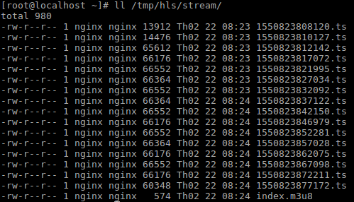
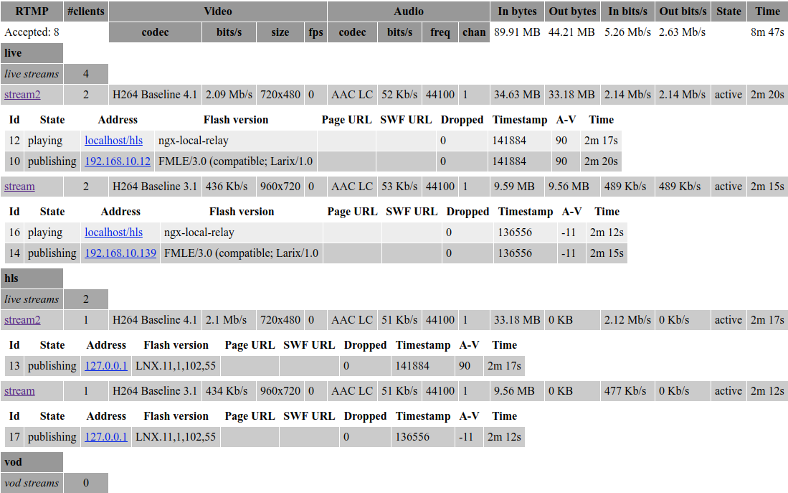

# Streaming Media với Nginx và nginx-rtmp module

# Table of contents

- [1. Giới thiệu nginx-rtmp](#about)
- [2. Cài đặt Nginx với module nginx-rtmp](#install-nginx-rtmp)
- [3. VOD qua RTMP](#vod-rtmp)
  - [3.1. Cấu hình Nginx](#nginx-rtmp)
  - [3.2. Sử dụng Video Player để chạy video](#vlc-player)
- [4. VOD qua HLS](#install-libx264)
  - [4.1 Cài đặt Ffmpeg](#install-ffmpeg)
  - [4.2 Convert tệp vod.mp4 sang HLS](#mp4-to-hls)
  - [4.3 Cấu hình nginx](#nginx-hls)
  - [4.4 Phát video trên web browser với videojs](#videojs)
- [5. Cấu hình Live Streaming](#live-streaming)
  - [5.1 Cấu hình Nginx để làm live streaming server](#nginx-live-streaming)
  - [5.2 Thực hiện live streaming từ mobile](#live-streaming-mobile)
  - [5.3 Kiểm tra quá trình Live Streaming](#check-streaming)
- [6. HLS encryption in the rtmp module](#hls-encryption)
- [7. Một số trang tham khảo](#reference)

=============================================================================

# Content

## <a name="about">1. Về  nginx-rtmp module</a>

Nginx-rtmp là module mở rộng, mà kết hợp với Nginx để cho phép xây dựng máy chủ streaming media.

Một số tính năng mà nginx-rtmp hỗ trợ:

- RTMP/HLS/MPEG-DASH live streaming

- RTMP Video on demand FLV/MP4, phát từ local file hoặc qua HTTP

- Stream relay support for distributed streaming: push & pull models

- Ghi streams vào nhiều tệp FLV

- Hỗ trợ H264/AAC

- Transcode trực tuyến với FFmpeg

- HTTP callbacks (publish/play/record/update etc)

- Module điều khiển HTTP để recording audio/video and dropping clients

- Kỹ thuật buffer tiên tiến để giữ cho bộ nhớ được cấp ở mức thấp nhất mà streaming vẫn nhanh.

- Kết hợp được với các ứng dụng như Wirecast, FMS, Wowza, JWPlayer, FlowPlayer, StrobeMediaPlayback, ffmpeg, avconv, rtmpdump, flvstreamer, ..

- Thống kê stream với định dạng XML/XSL

- Linux/FreeBSD/MacOS/Windows

## <a name="install-nginx-rtmp">2. Cài đặt Nginx với module nginx-rtmp</a>

**Step1**: Download & unpack  latest stable nginx & nginx-rtmp version

```
cd /opt
sudo git clone git://github.com/arut/nginx-rtmp-module.git
sudo wget http://nginx.org/download/nginx-1.14.1.tar.gz
sudo tar xzf nginx-1.14.1.tar.gz
mv nginx-1.14.1 nginx
```

**Step2**: Build nginx với nginx-rtmp

```
sudo ./configure --prefix=/etc/nginx \
--pid-path=/var/run/nginx.pid \
--conf-path=/etc/nginx/nginx.conf \
--sbin-path=/usr/sbin/nginx \
--user=nginx \
--group=nginx \
--with-file-aio \
--with-http_ssl_module \
--add-module=nginx-rtmp-module
sudo make
sudo make install
```

**Step3**: Run Nginx với systemd

- Create tệp /lib/systemd/system/nginx.service với nội dung sau:

```
Description=nginx - high performance web server
Documentation=http://nginx.org/en/docs/
After=network-online.target remote-fs.target nss-lookup.target
Wants=network-online.target

[Service]
Type=forking
ExecStartPre=/usr/sbin/nginx -t -c /etc/nginx/nginx.conf
ExecStart=/usr/sbin/nginx -c /etc/nginx/nginx.conf
ExecReload=/bin/kill -s HUP $MAINPID
ExecStop=/bin/kill -s QUIT $MAINPID

[Install]
WantedBy=multi-user.target
```

- Start Nginx service

```
systemctl enable nginx.service
systemctl start nginx.service
```

## <a name="vod-rtmp">3. VOD qua RTMP</a>

Chúng ta sẽ cấu hình để cho phép các video player xem video qua giao thức RTMP.

### <a name="nginx-rtmp">3.1 Cấu hình Nginx</a>

**Step1**: Tạo tệp tin cấu hình nginx với nội dung sau:

```
user  nginx;
worker_processes  1;
pid        /run/nginx.pid;
user nginx;

events {
    worker_connections  1024;
}
rtmp {
    server {
        listen 1935;
        chunk_size 4000;
        # video on demand for mp4 files
        application vod {
            play /var/mp4s;
        }
    }
}

http {
    access_log /var/log/nginx/access-streaming.log;
    error_log /var/log/nginx/error-streaming.log;
    server {
        listen      80;
        root /var/www/html;
        # RTMP statistics in XML
        location /stat {
            # Copy stat.xsl put to root directory
            rtmp_stat all;
            rtmp_stat_stylesheet stat.xsl;
        }
    }
}
```

Thông tin cấu hình tệp cấu như sau:

Khối rtmp { }

- listen port với 1935 (port default)

- application với đường dẫn ảo là **vod**

- Đường dẫn thư mục chứa các tệp video để phát là "/var/mp4s".

Khi đó muốn sử dụng chúng ta truy cập kiểu như "rtmp://192.168.10.113:1935/vod/video-name.mp4"

**Step2**: Tạo thư mục chứa và copy tệp tin video

```
mkdir /var/mp4s
cd /var/mp4s
```

Chúng ta download hoặc copy một tin video vào thư mục /var/mp4s

### <a name="vlc-player">3.2. Sử dụng Video Player để chạy video</a>

Chúng ta có thể sử dụng một trình phát video có hỗ trợ giao thức rtmp để phát.

Ở đây, chúng ta có thể sử dụng [VLC player](https://www.videolan.org/vlc/#download)

Mở player VLC → Nhấn Media → Chọn "Open Network Stream ..". Sau đó vào thông tin đường dẫn tệp video vod với **rtmp://192.168.10.113:1935/vod/vod.mp4**

<p align="center"> 

</p>

Cuối cùng nhấn Play để phát video.

<p align="center"> 

</p>

## <a name="vod-hls">4. VOD qua HLS</a>

Chúng ta sẽ cấu hình để cho phép video player phát video qua giao thức HLS (Apple HTTP Live Streaming).

### <a name="install-ffmpeg">4.1 Cài đặt Ffmpeg</a>

Sử dụng script [Installing FFmpeg on Linux](../scripts/install_ffmpeg.sh)

Nếu chỉ sử dụng một thư viện có sẵn thì cài đặt đơn giản như sau trên CentOS

`yum install ffmpeg ffmpeg-devel ffmpeg-libpostproc`

Trong phần [Giới thiệu FFmpeg](../docs/About-FFmpeg.md), cũng đã giới thiệu và cách sử dụng cơ bản FFmpeg.

### <a name="mp4-to-hls">4.2 Convert tệp vod.mp4 sang HLS</a>

Trước khi convert, chúng ta thực hiện copy/download tệp tin video lên server (ví dụ tệp tin là vod.mp4)

Sử dụng lệnh ffmpeg để convert vod.mp4 sang định dạng HLS (Apache HTTP Live Stream)

`ffmpeg -i video.mp4 -profile:v baseline -level 3.0 -s 720x400 -start_number 0 -hls_time 10 -hls_list_size 0 -f hls /tmp/index.m3u8`

Trong đó:

- vod.mp4 là tệp video đầu vào cần convert

- index.m3u8 là tệp tin master đầu ra của HLS playlist

- và một số tham số tùy chọn cho độ phân giải, thời gian phân đoạn, ..

### <a name="nginx-hls">4.3 Cấu hình nginx</a>

Ở đây, Chúng ta sẽ cấu hình nginx làm web server, đồng thời cấu hình làm media server.

```
user nginx;
worker_processes  1;
error_log  logs/rtmp_error.log debug;
pid        /var/run/nginx.pid;
events {
    worker_connections  1024;
}
http {
    #serve the player for HLS
    server {
        listen       80;
        root /var/www/html;
        server_name  localhost;
        location /hls {
            # CORS setup
            add_header 'Access-Control-Allow-Origin' '*' always;
            add_header 'Access-Control-Expose-Headers' 'Content-Length';
            # Allow CORS preflight requests
            if ($request_method = 'OPTIONS') {
                add_header 'Access-Control-Allow-Origin' '*';
                add_header 'Access-Control-Max-Age' 1728000;
                add_header 'Content-Type' 'text/plain charset=UTF-8';
                add_header 'Content-Length' 0;
                return 204;
            }
            types {
                application/vnd.apple.mpegurl m3u8;
                video/mp2t ts;
            }
            add_header Cache-Control no-cache;
            alias /tmp;
        }
    }
}
```

- Listen với port default 80

- URL của web server sẽ là http://192.168.10.113/; với root directory là /var/www/html

- URL của stream server sẽ là http://192.168.10.113/hls

- Playlist của stream là tệp tin m3u8, với các segment là tệp ts

- Đường dẫn thư mục chứa các playlist là /tmp

### <a name="videojs">4.4 Phát video trên web browser với videojs</a>

Chúng ta có thể phát video trên web browser, mà sử dụng flash player như Flowplayer hay Jwplayer. Trong trường  hợp này, tôi sẽ giới thiệu sử dụng videojs player cho phát video trên web browser.

Link về videojs: [https://github.com/videojs/http-streaming](https://github.com/videojs/http-streaming)

Trên Nginx web server, chúng ta sẽ tạo tệp tin index.html với nội dung sau vào root directory:


```
<!DOCTYPE html>
<html>
<head>
<meta charset=utf-8 />
<title>Videojs-HLS embed</title>
  
  <!--

  Uses the latest versions of video.js and videojs-http-streaming.

  To use specific versions, please change the URLs to the form:

  <link href="https://unpkg.com/video.js@6.7.1/dist/video-js.css" rel="stylesheet">
  <script src="https://unpkg.com/video.js@6.7.1/dist/video.js"></script>
  <script src="https://unpkg.com/@videojs/http-streaming@0.9.0/dist/videojs-http-streaming.js"></script>

  -->

  <link href="https://unpkg.com/video.js/dist/video-js.css" rel="stylesheet">
<style>
.center {
    margin-left: auto;
    margin-right: auto;
    display: block
}
</style>
</head>
<body>
<!--  <h1>Video.js Example Embed</h1> -->

  <video-js id="my_video_1" class="vjs-default-skin center" controls preload="auto" width="720" height="400" poster="../images/bbb-poster.jpg">
    <source src="http://192.168.10.113/hls/index.m3u8" type="application/x-mpegURL">
  </video-js>

  <script src="https://unpkg.com/video.js/dist/video.js"></script>
  <script src="https://unpkg.com/@videojs/http-streaming/dist/videojs-http-streaming.js"></script>

  <script>
    var player = videojs('my_video_1');
  </script>

</body>
</html>
```

Trong tệp index.html chúng ta sẽ vào đường dẫn chứa tệp tin playlist mà đã convert ở Step2. Khi đó vào thông tin đường dẫn URL ở đây là http://192.168.10.113/hls/index.m3u8

Cuối cùng duyệt http://192.168.10.113/index.html và xem kết quả

<p align="center"> 

</p>

Chúng ta thấy videojs cho khung nhìn tuyệt đẹp.

## <a name="live-streaming">5. Cấu hình Live Streaming</a>

Live Streaming là tính năng chính của nginx-rtmp module, và quá trình thực hiện live streaming sẽ qua giao thức RTMP.

Các bước cho thực hiện quá trình Live Streaming như sau:

### <a name="nginx-live-streaming">5.1 Cấu hình Nginx để làm live streaming server</a>

**Step1**: Tạo tệp tin nginx.conf với nội dung sau

```
user nginx;
pid /var/run/nginx.pid;
events {
    worker_connections 1024;
}
#RTMP configuration
rtmp {
    server {
        listen 1935;
 
        application live {
            live on;
            # Push the stream to the local HLS application
            push rtmp://localhost:1935/hls;
        }
 	
        application hls {
            live on;
 
            # Only accept publishing from localhost.
            allow publish 127.0.0.1;
            deny publish all;
            
            # Streams as HLS
            hls on;
            hls_path /tmp/hls;
            hls_fragment 3s;
            hls_nested on;
            hls_fragment_naming system;
        }
    }
}

#HTTP Configuration
http {
    sendfile off;
    tcp_nopush on;
    aio on;
    directio 512;
    default_type application/octet-stream;

    server {
        listen 80;
        root /var/www/html;
        server_name localhost;
        location /hls {
            # Disable cache
            add_header 'Cache-Control' 'no-cache';

            # CORS setup
            add_header 'Access-Control-Allow-Origin' '*' always;
            add_header 'Access-Control-Expose-Headers' 'Content-Length';

            # allow CORS preflight requests
            if ($request_method = 'OPTIONS') {
                add_header 'Access-Control-Allow-Origin' '*';
                add_header 'Access-Control-Max-Age' 1728000;
                add_header 'Content-Type' 'text/plain charset=UTF-8';
                add_header 'Content-Length' 0;
                return 204;
            }
            # MIME type for HLS
            types {
                application/dash+xml mpd;
                application/vnd.apple.mpegurl m3u8;
                video/mp2t ts;
            }

            alias /tmp/hls;
        }
        # RTMP statistics in XML
        location /stat {
            rtmp_stat all;
            rtmp_stat_stylesheet stat.xsl;
        }
    }
}
```

Ở đây, chúng ta sẽ cấu hình nginx làm nhiệm vụ là web server và live streaming server.

- Block http { } : Dựng nginx làm web server với mục đích thống kê số liệu, cho phép người dùng xem live streaming. Nếu không cần dùng các chức năng này, chúng ta có thể qua bỏ block này. Quá trình tạo server cho xem live streaming có thể thực hiện ở server khác.

- Block rtmp { } : Dựng nginx làm live streaming server, để thực hiện quá trình thu phát live streaming từ client và publish luồng

Diễn giải một số directive cho cấu hình nginx trên như sau:

- live on: Bật tính năng live stream.

- push rtmp://localhost:1935/hls : Thực hiện push streaming vào /hls

- allow publish 127.0.0.1; Khai báo server từ xa được phép push stream đến hệ thống. Ở đây chúng ta sẽ khai báo localhost được phép push stream đến hệ thống localhost. Kết hợp với `deny publish all`, nhằm hạn chế remote server nào đó push stream vào hệ thống của mình.

- deny publish all;

- hls on: Bật chế độ HLS, cho phép client có thể sử dụng chế độ này

- hls_path /tmp/hls: Thiết lập đường dẫn thư mục chứa playlist và fragments của HLS. Nếu không chỉ định thì nó tự động tạo.

- hls_fragment 3s: Thực hiện tạo mỗi fragment với 03 second (fragment *.ts). Thường thì mỗi tệp ts được sinh ra gồm 3s + time decode)

- hls_nested on; Bật chế độ lồng. Dùng để tạo ra một subdirectory của “hls_path” cho mỗi stream. Playlist và fragments sẽ được tạo ra cùng thư mục đó. Ví dụ /tmp/hls/
stream-name. Mặc định chế độ này là off, vì vậy stream sẽ tạo ra playlist và fragments ở thư mục của của đường dẫn hls_path, với kiểu tên là stream-name-..ts và stream-name.m3u8

- hls_fragment_naming system: Tên của fragment, có thể định dạng với các kiểu "system, sequential, timestamp"

**Step2**: Tạo thư mục và copy tệp statistics dạng xml

```
mkdir /tmp/hls
chown -R nginx:nginx
copy /opt/nginx/nginx-rtmp-module/stat.xsl /var/www/html
systemctl restart nginx
```

**Step3**: Tạo tệp tin index.html

Chúng ta thực hiện tạo tệp tin tĩnh index.html để tạo web player cho xem live streaming qua web browser

```
<!DOCTYPE html>
<html>
<head>
<meta charset=utf-8 />
<title>Videojs-HLS embed</title>
  
  <!--

  Uses the latest versions of video.js and videojs-http-streaming.

  To use specific versions, please change the URLs to the form:

  <link href="https://unpkg.com/video.js@6.7.1/dist/video-js.css" rel="stylesheet">
  <script src="https://unpkg.com/video.js@6.7.1/dist/video.js"></script>
  <script src="https://unpkg.com/@videojs/http-streaming@0.9.0/dist/videojs-http-streaming.js"></script>

  -->

  <link href="https://unpkg.com/video.js/dist/video-js.css" rel="stylesheet">
<style>
.center {
    margin-left: auto;
    margin-right: auto;
    display: block
}
</style>
</head>
<body>
<!--  <h1>Video.js Example Embed</h1> -->

  <video-js id="my_video_1" class="vjs-default-skin center" controls preload="auto" width="720" height="400" poster="../images/bbb-poster.jpg">
    <source src="http://192.168.10.113/hls/stream/index.m3u8" type="application/x-mpegURL">
  </video-js>

  <script src="https://unpkg.com/video.js/dist/video.js"></script>
  <script src="https://unpkg.com/@videojs/http-streaming/dist/videojs-http-streaming.js"></script>

  <script>
    var player = videojs('my_video_1');
  </script>

</body>
</html>
```

**Note**: Thay đường dẫn **http://192.168.10.113/hls/stream/index.m3u8** với đường dẫn chứa thông tin tệp stream phù hợp.

### <a name="live-streaming-mobile">5.2 Thực hiện live streaming từ mobile</a>

Sử dụng một phần mềm live streaming bất kỳ, hỗ trợ giao thức RTMP. Ở đây, tôi sử dụng android nên cài đặt soft **Larix Broadcaster**

- Mở  Larix Broadcaster → Nhấn biểu tượng Setting → Connections → Sau đó vào các thông tin kết nối đến Live Streaming server.

**rtmp://192.168.10.113:1935/live/stream**

(Với tên “stream” là tên bất kỳ do mình đặt. Tên này sau khi lên live server, tương ứng với biến $name)

- Cuối cùng nhấn vào biểu tượng quay phát để live streaming thôi

### <a name="check-streaming">5.3 Kiểm tra quá trình Live Streaming</a>

**Step1**: Xem thông tin tệp streaming trên server

Dùng lệnh để list xem quá trình sinh ra luồng stream với tệp playlist và fragments

<p align="center"> 

</p>

**Step2**: Thực hiện xem live stream qua web browser

Mở web browser và truy cập **http://192.168.10.113/** để xem live streaming

<p align="center"> 

</p>

**Step3**: Xem thống kê số liệu streaming

Truy cập **http://192.168.10.113/stat**

<p align="center"> 

</p>

## <a name="hls-encryption">6. HLS encryption in the rtmp module</a>

Updating ...

## <a name="reference">7. Một số trang tham khảo</a>

- https://github.com/arut/nginx-rtmp-module

- https://github.com/videojs/http-streaming

